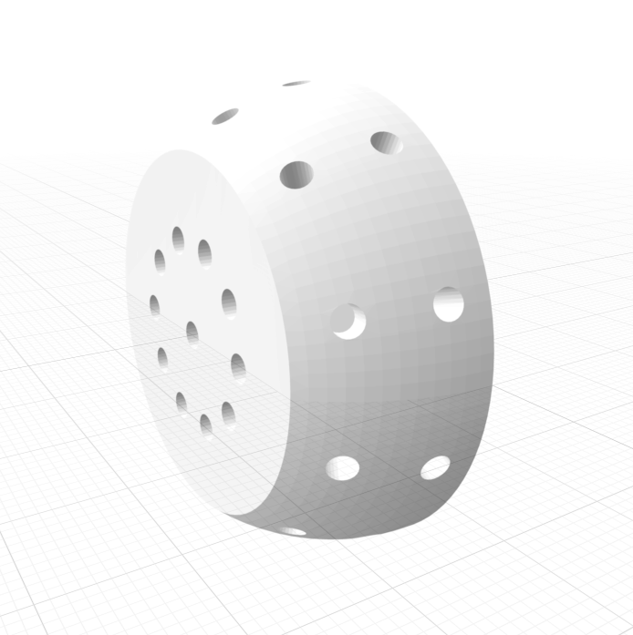

# Robotics Lab 3D Printing Designs

This respository serves as a tracking of STL files, for designs created and used within the lab.
| Name             | Description                          | Image                           | Download File               | More info |
|------------------|--------------------------------------|---------------------------------|-----------------------------| --------------|
| Universal Marker     | STL file for creating arbitrary rigid bodies |           | [Download](files/optitrack/Universal_Marker_3.stl)     | Add Link to Repository |
| WX-250 Base | STL file for base of WX-250 robot arm |  | [Download](files/WX-250_robot_garden/base/bottom_base_WX-250.stl) | [link to repo](https://github.com/IE-Robotics-Lab/WX250_support_structure) |
| WX-250 Electronic Lid | STL file for lid for base of WX-250 robot arm |  | [Download](files/WX-250_robot_garden/base/lid_electronics_WX-250.stl) | [link to repo](https://github.com/IE-Robotics-Lab/WX250_support_structure) |
| WX-250 Short Rest position | STL file for short tree for rest position WX-250 robot arm |  | [Download](files/WX-250_robot_garden/rest_pos_supports/short_stick_tree.stl) | [link to repo](https://github.com/IE-Robotics-Lab/WX250_support_structure) |
| WX-250 Long Rest position | STL file for long tree for rest position WX-250 robot arm |  | [Download](files/WX-250_robot_garden/rest_pos_supports/long_stick_tree.stl) | [link to repo](https://github.com/IE-Robotics-Lab/WX250_support_structure) |
| WX-250 70° tree Rest position | STL file for 70° curve tree for rest position WX-250 robot arm |  | [Download](files/WX-250_robot_garden/rest_pos_supports/deg70stick_tree.stl) | [link to repo](https://github.com/IE-Robotics-Lab/WX250_support_structure) |
| WX-250 90° tree Rest position | STL file for 90° curve tree for rest position WX-250 robot arm |  | [Download](files/WX-250_robot_garden/rest_pos_supports/deg90stick_tree.stl) | [link to repo](https://github.com/IE-Robotics-Lab/WX250_support_structure) |